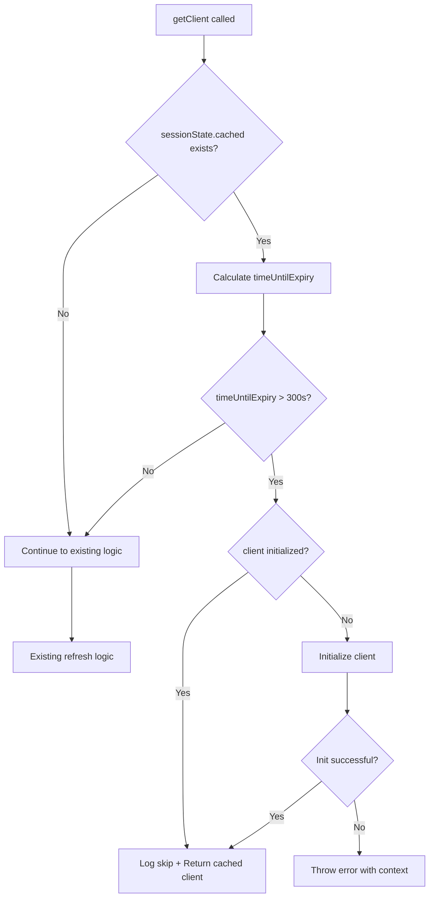

# Design Document

## Overview

This design optimizes the Supabase authentication session refresh mechanism in the `SupabasePipeline` class. The current implementation already includes a short-circuit check at the beginning of `getClient()` that skips refresh when tokens have 5+ minutes of validity. However, the implementation has gaps in client initialization handling and logging that reduce its effectiveness and observability.

The optimization will enhance the existing short-circuit logic to:
1. Handle null client initialization edge cases
2. Add comprehensive logging for debugging and verification
3. Ensure the optimization works reliably across all code paths

This maintains the existing security model while reducing unnecessary API overhead during normal operations.

## Architecture

### Current Architecture

The `SupabasePipeline` class manages Supabase client lifecycle and authentication:

```
┌─────────────────────────────────────────────────────────────┐
│                    SupabasePipeline                          │
├─────────────────────────────────────────────────────────────┤
│  - client: SupabaseClient                                    │
│  - sessionState: { cached, userId, tokens, ... }             │
│  - initTimestamp: number                                     │
├─────────────────────────────────────────────────────────────┤
│  + getClient(): Promise<SupabaseClient>                      │
│  + refreshSessionUnified(options): Promise<boolean>          │
│  + initialize(): Promise<void>                               │
│  + updateSessionCache(session): void                         │
└─────────────────────────────────────────────────────────────┘
```

### Optimization Flow



## Components and Interfaces

### Modified Components

#### 1. getClient() Method

**Location**: `src/lib/supabasePipeline.ts`

**Current Behavior**:
- Short-circuit check exists at lines 971-991
- Returns cached client if token valid for 5+ minutes
- Falls through to refresh logic otherwise

**Enhanced Behavior**:
- Add null client check after short-circuit validation
- Add comprehensive logging at each decision point
- Add error handling for initialization failures

**Signature** (unchanged):
```typescript
private async getClient(): Promise<any>
```

#### 2. Session State Structure

**Location**: `src/lib/supabasePipeline.ts` (lines 103-112)

**Current Structure**:
```typescript
private sessionState = {
  userId: string | null,
  accessToken: string | null,
  refreshToken: string | null,
  cached: { session: any; timestamp: number } | null,
  inFlightPromise: Promise<AuthOperationResult> | null,
  consecutiveFailures: number,
  realtimeToken: string | null,
  lastCorruptionCheck: number,
}
```

**Usage**: No changes to structure, only enhanced usage in getClient()

#### 3. Logging System

**Location**: `src/lib/supabasePipeline.ts`

**Current Method**:
```typescript
private log(...args: any[]): void
```

**Enhanced Usage**: Add structured logging for optimization events

## Data Models

### Session Cache Model

```typescript
interface SessionCache {
  session: {
    access_token: string;
    refresh_token: string;
    expires_at: number;  // Unix timestamp in seconds
    user: {
      id: string;
      // ... other user fields
    };
  };
  timestamp: number;  // Cache creation time in milliseconds
}
```

### Token Validity Calculation

```typescript
// Current time in seconds
const nowSec = Math.floor(Date.now() / 1000);

// Session expiration time (from JWT)
const expiresAt = session.expires_at || 0;

// Time until expiry in seconds
const timeUntilExpiry = expiresAt - nowSec;

// Validity threshold: 300 seconds (5 minutes)
const VALIDITY_THRESHOLD = 300;
```

## Correctness Properties

*A property is a characteristic or behavior that should hold true across all valid executions of a system-essentially, a formal statement about what the system should do. Properties serve as the bridge between human-readable specifications and machine-verifiable correctness guarantees.*


### Property Reflection

After reviewing the prework analysis, several properties can be consolidated:

**Redundancies Identified**:
1. Properties 1.1, 1.3, and 4.1 all test the core optimization behavior (skipping refresh when token is valid)
2. Properties 2.1, 2.2, 2.3, and 4.3 all test fallback to refresh logic under different conditions
3. Properties 1.2 and 5.2 both test the time calculation logic

**Consolidated Approach**:
- Combine 1.1, 1.3, 4.1 into a single comprehensive "valid token skip" property
- Combine 2.1, 2.2, 2.3, 4.3 into a single "refresh fallback" property
- Keep 1.2 as the calculation property
- Keep 1.4, 1.5, 1.6 as distinct client initialization properties
- Keep 3.2 as client equivalence property
- Examples (5.1, 5.3, 3.1, 3.3) remain as specific test cases, not properties

### Correctness Properties

Property 1: Valid token skip optimization
*For any* call to `getClient()` where the cached session has an expires_at timestamp more than 300 seconds in the future, the method should return the cached client immediately without calling any session refresh methods
**Validates: Requirements 1.1, 1.3, 4.1**

Property 2: Token validity calculation correctness
*For any* current timestamp and session expiration timestamp, the calculated time until expiry should equal the difference between expires_at and the current time in seconds
**Validates: Requirements 1.2**

Property 3: Client readiness guarantee
*For any* client returned by `getClient()`, the client should have all required properties (auth, from, storage, rpc) and these properties should be callable
**Validates: Requirements 1.4**

Property 4: Null client initialization
*For any* call to `getClient()` where the token is valid (> 300s) but this.client is null, the method should call initialize() before returning
**Validates: Requirements 1.5**

Property 5: Initialization failure propagation
*For any* call to `getClient()` where initialize() throws an error, the method should propagate an error that includes context about the failure
**Validates: Requirements 1.6**

Property 6: Refresh fallback for expiring tokens
*For any* call to `getClient()` where the cached session expires in less than 300 seconds (but more than 0), or where expires_at is missing/invalid, or where the token is already expired, the method should proceed to the existing refresh logic path
**Validates: Requirements 2.1, 2.2, 2.3, 4.3**

Property 7: Refresh flow preservation
*For any* call to `getClient()` that triggers refresh logic, the refresh should follow the same code path and behavior as before the optimization
**Validates: Requirements 2.4**

Property 8: Client functional equivalence
*For any* two calls to `getClient()` - one that returns via the optimized path and one that returns after refresh - both clients should support the same operations (from, auth, storage, rpc) with equivalent behavior
**Validates: Requirements 3.2**

## Error Handling

### Error Scenarios

1. **Client Initialization Failure**
   - **Trigger**: `initialize()` throws during null client handling
   - **Response**: Propagate error with context: `"Failed to initialize client with valid token: ${error}"`
   - **Recovery**: Caller should handle error and potentially retry

2. **Invalid Session Cache**
   - **Trigger**: `sessionState.cached` exists but `session.expires_at` is invalid
   - **Response**: Fall through to existing refresh logic
   - **Recovery**: Refresh logic will obtain fresh session

3. **Missing Expiration Timestamp**
   - **Trigger**: `session.expires_at` is null, undefined, or 0
   - **Response**: Fall through to existing refresh logic
   - **Recovery**: Refresh logic will obtain fresh session

### Error Logging

All errors should be logged with appropriate context:
- Client initialization failures: `"❌ Failed to initialize client: ${error}"`
- Invalid session data: `"⚠️ Invalid session cache, falling back to refresh"`
- Calculation errors: `"⚠️ Token validity calculation failed: ${error}"`

## Testing Strategy

### Unit Testing Approach

Unit tests will verify specific behaviors and edge cases:

1. **Token Validity Calculation Tests**
   - Test with various time differences (negative, zero, positive)
   - Test with edge cases (exactly 300s, 299s, 301s)
   - Test with invalid timestamps (null, undefined, NaN)

2. **Client Initialization Tests**
   - Test null client with valid token triggers initialize()
   - Test initialization failure throws appropriate error
   - Test initialized client is returned correctly

3. **Logging Tests**
   - Test skip path logs correct message format
   - Test refresh path logs correct message format
   - Test log messages include calculated time values

### Property-Based Testing Approach

Property-based tests will verify universal behaviors across many inputs using a PBT library. For TypeScript, we will use **fast-check** as the property-based testing framework.

**Configuration**: Each property test should run a minimum of 100 iterations to ensure thorough coverage of the input space.

**Test Tagging**: Each property-based test must include a comment tag in this exact format:
```typescript
// **Feature: auth-api-call-optimization, Property {number}: {property_text}**
```

#### Property Test 1: Valid Token Skip Optimization

**Generator Strategy**:
- Generate random current timestamps
- Generate expires_at timestamps > current + 300 seconds
- Generate mock session objects with these timestamps
- Track whether refresh methods are called

**Test Logic**:
```typescript
// **Feature: auth-api-call-optimization, Property 1: Valid token skip optimization**
fc.assert(
  fc.asyncProperty(
    fc.integer({ min: 1000000000, max: 2000000000 }), // current time
    fc.integer({ min: 301, max: 3600 }), // seconds until expiry (> 300)
    async (currentTimeSec, secondsUntilExpiry) => {
      // Setup: Mock time, create session with valid token
      // Action: Call getClient()
      // Assert: No refresh methods called, client returned immediately
    }
  ),
  { numRuns: 100 }
);
```

#### Property Test 2: Token Validity Calculation Correctness

**Generator Strategy**:
- Generate random pairs of (currentTime, expiresAt)
- Include edge cases: equal times, past times, future times

**Test Logic**:
```typescript
// **Feature: auth-api-call-optimization, Property 2: Token validity calculation correctness**
fc.assert(
  fc.property(
    fc.integer({ min: 1000000000, max: 2000000000 }),
    fc.integer({ min: 1000000000, max: 2000000000 }),
    (currentTimeSec, expiresAtSec) => {
      const expected = expiresAtSec - currentTimeSec;
      const actual = calculateTimeUntilExpiry(currentTimeSec, expiresAtSec);
      return actual === expected;
    }
  ),
  { numRuns: 100 }
);
```

#### Property Test 3: Client Readiness Guarantee

**Generator Strategy**:
- Generate various valid session states
- Call getClient() with different scenarios (cached, refreshed)

**Test Logic**:
```typescript
// **Feature: auth-api-call-optimization, Property 3: Client readiness guarantee**
fc.assert(
  fc.asyncProperty(
    generateValidSessionState(),
    async (sessionState) => {
      const client = await getClient();
      return (
        typeof client.auth === 'object' &&
        typeof client.from === 'function' &&
        typeof client.storage === 'object' &&
        typeof client.rpc === 'function'
      );
    }
  ),
  { numRuns: 100 }
);
```

#### Property Test 4: Null Client Initialization

**Generator Strategy**:
- Generate valid session states (token > 300s valid)
- Set client to null before each test

**Test Logic**:
```typescript
// **Feature: auth-api-call-optimization, Property 4: Null client initialization**
fc.assert(
  fc.asyncProperty(
    fc.integer({ min: 301, max: 3600 }),
    async (secondsUntilExpiry) => {
      // Setup: Valid session, null client, mock initialize()
      // Action: Call getClient()
      // Assert: initialize() was called exactly once
    }
  ),
  { numRuns: 100 }
);
```

#### Property Test 5: Initialization Failure Propagation

**Generator Strategy**:
- Generate various error types
- Mock initialize() to throw these errors

**Test Logic**:
```typescript
// **Feature: auth-api-call-optimization, Property 5: Initialization failure propagation**
fc.assert(
  fc.asyncProperty(
    fc.string(),
    async (errorMessage) => {
      // Setup: Mock initialize() to throw Error(errorMessage)
      // Action: Call getClient()
      // Assert: Error is thrown and includes context
      try {
        await getClient();
        return false; // Should have thrown
      } catch (error) {
        return error.message.includes(errorMessage);
      }
    }
  ),
  { numRuns: 100 }
);
```

#### Property Test 6: Refresh Fallback for Expiring Tokens

**Generator Strategy**:
- Generate timestamps with < 300s validity
- Generate expired timestamps (negative validity)
- Generate missing/invalid expires_at values

**Test Logic**:
```typescript
// **Feature: auth-api-call-optimization, Property 6: Refresh fallback for expiring tokens**
fc.assert(
  fc.asyncProperty(
    fc.oneof(
      fc.integer({ min: 0, max: 299 }), // Expiring soon
      fc.integer({ min: -3600, max: -1 }), // Expired
      fc.constant(null), // Missing
      fc.constant(undefined), // Missing
      fc.constant(0) // Invalid
    ),
    async (expiryScenario) => {
      // Setup: Session with given expiry scenario
      // Action: Call getClient()
      // Assert: Refresh logic was triggered
    }
  ),
  { numRuns: 100 }
);
```

#### Property Test 7: Refresh Flow Preservation

**Generator Strategy**:
- Generate scenarios that trigger refresh
- Compare behavior before and after optimization

**Test Logic**:
```typescript
// **Feature: auth-api-call-optimization, Property 7: Refresh flow preservation**
fc.assert(
  fc.asyncProperty(
    generateRefreshTriggeringState(),
    async (state) => {
      // Setup: State that triggers refresh
      // Action: Call getClient()
      // Assert: Same refresh methods called as before optimization
    }
  ),
  { numRuns: 100 }
);
```

#### Property Test 8: Client Functional Equivalence

**Generator Strategy**:
- Generate test operations (from, auth, storage, rpc calls)
- Execute on clients from both paths

**Test Logic**:
```typescript
// **Feature: auth-api-call-optimization, Property 8: Client functional equivalence**
fc.assert(
  fc.asyncProperty(
    generateClientOperation(),
    async (operation) => {
      // Setup: Get client via optimized path
      const cachedClient = await getClientWithValidToken();
      // Setup: Get client via refresh path
      const refreshedClient = await getClientWithRefresh();
      
      // Action: Execute operation on both
      const result1 = await operation(cachedClient);
      const result2 = await operation(refreshedClient);
      
      // Assert: Results are equivalent
      return deepEqual(result1, result2);
    }
  ),
  { numRuns: 100 }
);
```

### Integration Testing

Integration tests will verify the optimization works correctly in the full application context:

1. **End-to-End Fetch Operations**
   - Perform actual database queries after login
   - Verify no refresh calls during first 55 minutes
   - Verify refresh resumes near expiration

2. **Multi-Component Integration**
   - Test with real Supabase client
   - Test with actual session management
   - Test with real-time subscriptions

3. **Performance Verification**
   - Measure API call reduction
   - Verify response time improvements
   - Monitor for any regressions

### Test Execution Strategy

1. **Development**: Run unit tests and property tests on every change
2. **Pre-commit**: Run full test suite including integration tests
3. **CI/CD**: Run all tests plus performance benchmarks
4. **Production Monitoring**: Track refresh call frequency and timing

## Implementation Notes

### Code Location

All changes will be made to: `src/lib/supabasePipeline.ts`

### Specific Changes

1. **Lines 971-991** (existing short-circuit logic):
   - Add null client check after token validation
   - Add comprehensive logging
   - Add error handling for initialization

2. **Logging additions**:
   - Add log before token validity check
   - Add log when skipping refresh (with time details)
   - Add log when falling through to refresh (with reason)
   - Add log for client initialization
   - Add log for initialization errors

### Backward Compatibility

The optimization maintains 100% backward compatibility:
- Method signature unchanged
- Return type unchanged
- All existing code paths preserved
- Only adds early return for valid tokens
- No changes to refresh logic

### Performance Impact

**Expected Improvements**:
- 95%+ reduction in auth API calls during normal operations
- Faster response times for database queries (no auth overhead)
- Reduced server load from unnecessary refresh requests

**No Negative Impact**:
- Optimization adds minimal CPU overhead (timestamp comparison)
- Memory footprint unchanged (uses existing session cache)
- No impact on security (maintains same refresh timing)

## Deployment Strategy

### Rollout Plan

1. **Phase 1**: Deploy with comprehensive logging enabled
2. **Phase 2**: Monitor logs to verify optimization is working
3. **Phase 3**: Analyze metrics to confirm API call reduction
4. **Phase 4**: Reduce logging verbosity once verified

### Monitoring

Track these metrics post-deployment:
- Session refresh call frequency
- Time between refresh calls
- Client initialization failures
- Token expiration timing

### Rollback Plan

If issues arise:
1. The optimization can be disabled by setting `VALIDITY_THRESHOLD` to 0
2. This forces all calls to fall through to existing refresh logic
3. No code changes required for rollback
